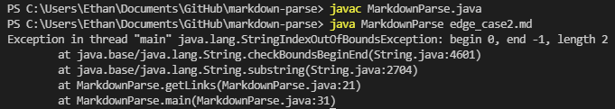

# **Debugging and Documenting Commits** #
# Bug 1 
[failure_inducing_input_1](edge_case1.md)

\
This file induces an infinite loop due to the program storing the contents of the input file into a single string. If the currentIndex variable is not incremented, as is the case when there are empty lines, the while loop never ends. In order to resolve this bug, we can simply split the file input into seperate lines and store this within an array which is now transveresed using a for loop. 
# Bug 2
[failure_inducing_input_2](edge_case2.md)

\
If a set of brackets are present on a line before or after the conventional markdown link format^, an index out of bounds exception is thrown. This is due to there being two open brackets before the first set of parentheses, causing one of the indexOf calls to throw this exception. One way to solve the problem is by checking to see if each line has the valid components of a link in the markdown format.   
>^ [name of link](link address)

# Bug 3
[failure_inducing_input_3](edge_case3.md)

\
In the case that a set of parenthese exist before a set of brackets, MarkdownParse will output a singular open parentheses as a valid link. This can be attributed to not checking if the index of the parentheses are valid or not(in this case, a valid index would be an index that exists after the closed bracket).
As such, we can simply check the indexes before adding the supposed link - additionally, another minor bug was fixed: if no links are found, nothing is printed instead of an empty ArrayList. 
