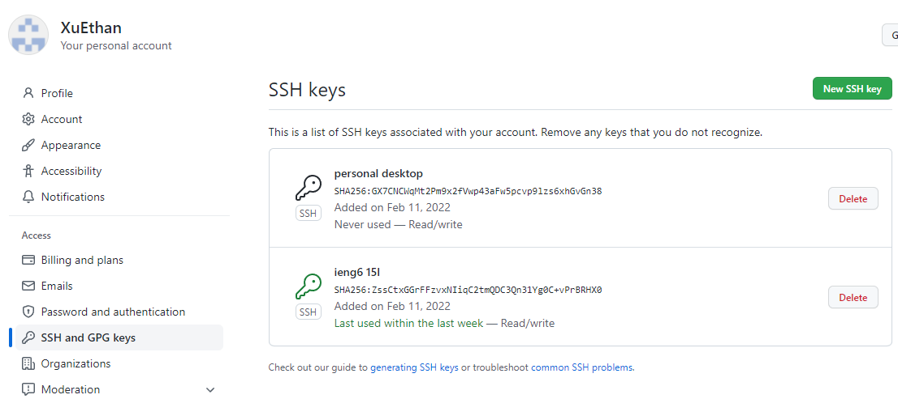
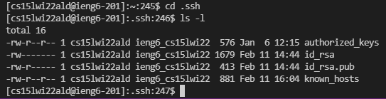
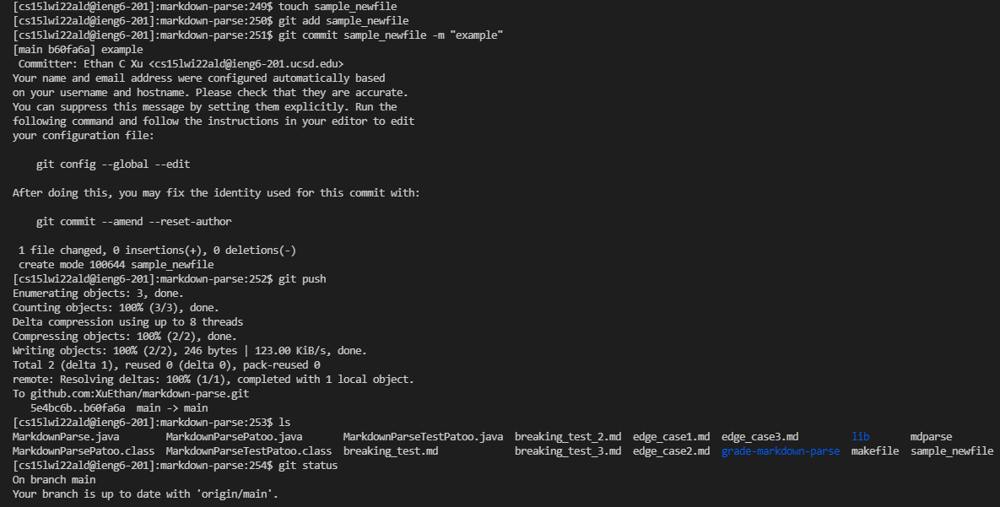
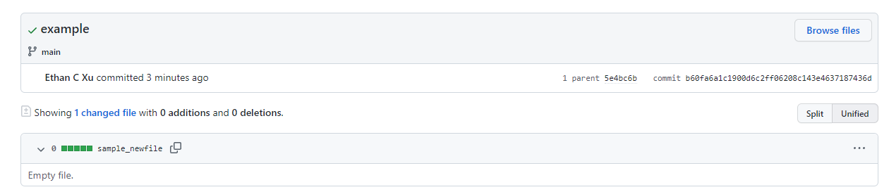

# **Setting Up Github Access From ieng6** #
# Adding keys to Github
\
Using an SSH keypair is necessary in order to push commits to github from a terminal. SSH keys can be added to your github account by going to the account settings page and finding the "SSH and GPG keys" tab under Access. From here, click "New SSH key" and enter a name for the key as well as the contents of the public key you are trying to add. 
# Key Pair on the Server
\
The public key that we added to github and the private key associated with it are both stored in the .ssh folder on the ieng6 server. It is important to note that if you want to push to github from ieng6, the key pair will need to be stored on the server. As such, a new pair can be created specifically for the server and github by running `ssh-keygen`.
# Working Git Commands While on ieng6
\
Now that we have established a keypair between the server and github, we can utilize git commands to add, commit, and push a change to our repository. This change is then made to the respective branch and the repository is updated. In order to check the current status of the changes we have made, we can run `git status`. 
# Commit Reflected on Github
\
[link to the commit](https://github.com/XuEthan/markdown-parse/commit/b60fa6a1c1900d6c2ff06208c143e4637187436d)\
After the commit has been pushed to the correct branch, we can find it in the commit history. Above is an image and link to the resulting commit from the git commands that we ran in the previous step. 