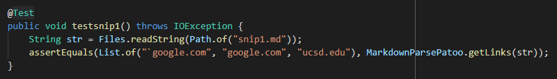
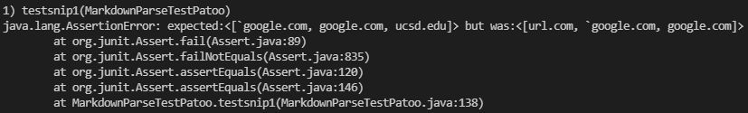
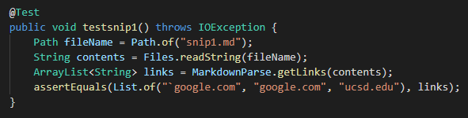
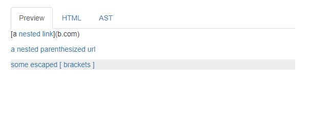

# **Debugging** #
# Links to markdown-parse Repositories 
my repository - https://github.com/XuEthan/markdown-parse

week 7 peer repository - https://github.com/yih365/markdown-parse
# Snippet 1 
```
`[a link`](url.com)

[another link](`google.com)`

[`cod[e`](google.com)

[`code]`](ucsd.edu)
```

We expect that getLinks will retrieve the following links: `google.com, google.com, ucsd.edu. 


Test case created to test snippet 1 using my implementation: 
\
**Ths case did not pass:**




Test case created to test snippet 1 using other implementation: 
\
**This case did not pass:**


I believe that a small code change less than 10 lines can be made in order to resolve conflicts with backticks. A solution that could be made in my program would be to simply ignore backticks when searching for links, as they are not a valid part of a url. As such, when looking for the link after the brackets, we can use indexOf to build the url string without incorporating backticks. 

# Snippet 2 
```
[a [nested link](a.com)](b.com)

[a nested parenthesized url](a.com(()))

[some escaped \[ brackets \]](example.com)
```

We expect that getLinks will retrieve the following links: a.com, a.com(()), example.com



Test case created to test snippet 2 using my implementation: 
\
**Ths case did not pass:**


Test case created to test snippet 2 using other implementation: 
\
**This case did not pass:**


I think that a small code change less than 10 lines can be made in order to resolve the conflict with nested parentheses, brackets, and escaped brackets. Because parentheses are valid within a url, we can implement a stack in order to trace the brackets and parentheses. By doing so, we can only take the most outer layer of brackets or parentheses into account and as such also fetch urls with parentheses correctly.  

# Snippet 3
```
[this title text is really long and takes up more than 
one line

and has some line breaks](
    https://www.twitter.com
)

[this title text is really long and takes up more than 
one line](
    https://ucsd-cse15l-w22.github.io/
)


[this link doesn't have a closing parenthesis](github.com

And there's still some more text after that.

[this link doesn't have a closing parenthesis for a while](https://cse.ucsd.edu/


)

And then there's more text
```

We expect that getLinks will retrieve the following link: https://ucsd-cse15l-w22.github.io/.


Test case created to test snippet 3 using my implementation: 
\
**Ths case did not pass:**


Test case created to test snippet 3 using other implementation: 
\
**This case did not pass:**


I do not think that a change can be made in less than 10 lines to account for both newlines in brackets and parentheses as well as links without closing parentheses. In order to to account for new lines, all empty lines in the input file can be removed as part of the pre processing after the file is read and stored as a string. However, to resolve the problem of links without closing parentheses, we would need to implement a stack in order to trace the layers of parentheses and brackets in order to fetch the link-ultimately taking more than ten lines of code.
