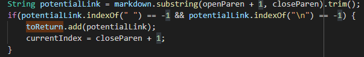

# **Different Outputs for Different Implementations of MarkdownParse**
Comparison repository: https://github.com/ucsd-cse15l-w22/markdown-parse \
My repository: https://github.com/XuEthan/markdown-parse
# How the Test Cases Were Found
Both test cases were found using the `diff` command on the text file outputs of both implementations of MarkdownParse on the same set of test files. These test files were run using a bash script which also prints the file tested for each line:\
\
<sub>*note that the only difference for the script between the two implementations is the name of the class. In the example above, the script for my implementation is shown\
*the diff command was run with the given implementation as the first argument, thus a `<` denotes the given implementation output and a `>` denotes the output from my implementation. 
<sub>

# Test 1
22.md
```
[foo](/bar\* "ti\*tle")
```
\
\
As shown above, we expect that the following link is in the output: bar*
\
Given the above output, we can conclude that both my implementation and the given implemenation produce the wrong output.

The bug for my implementation is a result of pulling the entire string between the parentheses after the first set of brackets as the link. This can potentially be resolved by parsing through the string of characters between the parentheses and looking for a link which is denoted by a forward slash. The url can then be determined as the characters between the forward slash and the next space. Additionally, slashes should be ignored as they are not a valid part of the url. 

Below is the part of my code that should be altered: 


# Test 2
201.md
```
[foo]: <bar>(baz)

[foo]
```
\
As shown above, we expect that no links should be in the output\
\
Given the above output, we can conclude that given implementation produces the wrong output. 

The bug in this case for the given implementation is that there exists a set of angled brackets between the first set of brackets and the set of parentheses, thus invaldiating the link format. This can be resolved through checking for a set of angled brackets in the substring of characters between the closed bracket and open parentheses while parsing through the file. 

Below is the part of the given code that should be altered: 


