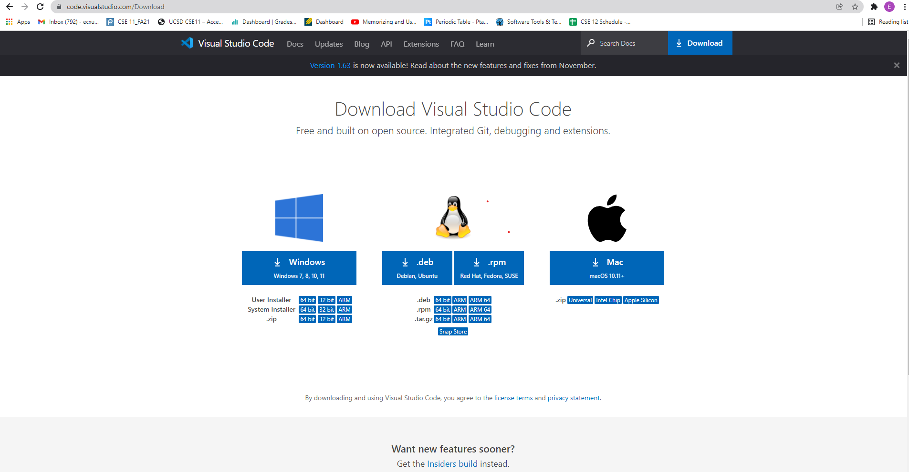
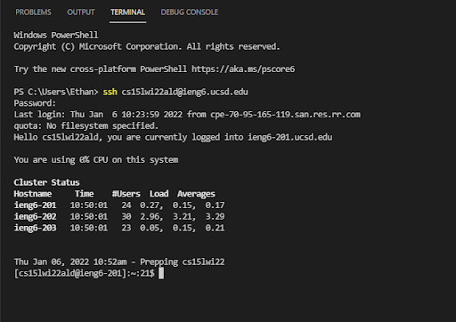
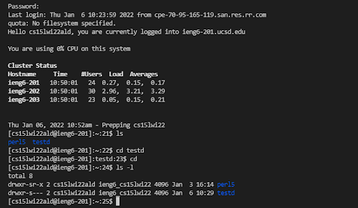
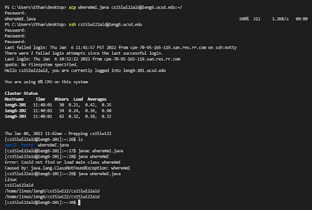
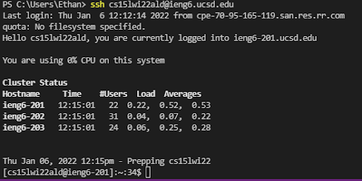
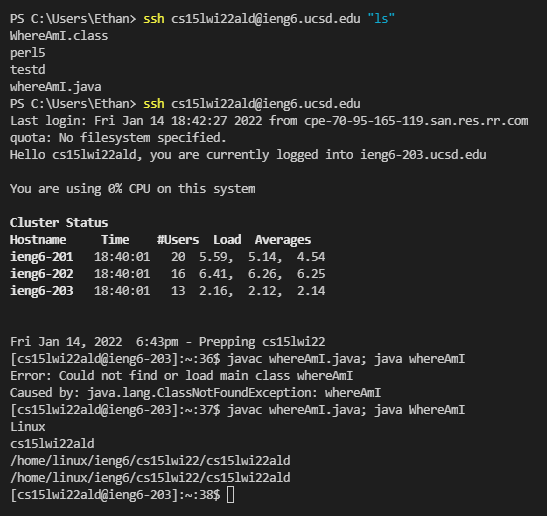

# **Logging into a course-specific account on ieng6**
## 1. Installing VScode

VScode can be downloaded for free at [https://code.visualstudio.com/Download](https://code.visualstudio.com/Download). Choose the correct version that matches the operating system that your computer is running. After opening the installer, follow the prompted directions to finish installing the software.
## 2. Remotely Connecting
\
After opening VScode, open a new terminal through the terminal tab at the top left of the application. Find the username and password for your course-specific account at [https://sdacs.ucsd.edu/~icc/index.php](https://sdacs.ucsd.edu/~icc/index.php). Use the command line to enter your username and password following the format presented in the image above.
## 3. SSH Commands
\
A few basic SSH commands that can be used to navigate the server include cd, ls, and ls -l. cd followed by a directory name changes the current directory to a child directory under it, while ls lists the contents of the current directory. ls -l provides a more detailed or longer list of the contents.
## 4. Moving Files With scp 
\
Files can be moved onto the server using the scp command. Start at the location where the file is located and follow the command line format provided in the image above. Note that the ~/ represent the location where the designated file will be moved.
## 5. Setting an SSH Key 
\
Setting up an SSH key can reduce the hassle in entering a password everytime you would like to access the server, demonstrated in the image above. A private and public key should be generate on your own computer by running "ssh-keygen" without quotations. The final step is to move the public key file to the .ssh directory of your user account on the server.
## 6. Optimizing Remote Running 
\
Remote running can be further optimized through additional command line specification. For instance, commands can be run on the server by including them in quotations after the ssh command. Multiple commands can also be run on the same line by seperating them with a semicolon.

